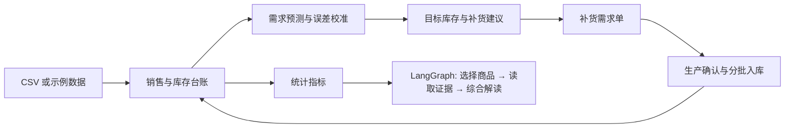

# StockPilot 的实现边界

页面包括总览、需求计划、补货需求单、库存明细、销售明细、经营分析与数据设置。

需求预测和补货数量由 Python 算法计算，AI 不代替数值计算。Agent 在 `demo/analytics_agent.py`，模型接口在 `demo/model_client.py`。没有旧聊天入口、Shopify/MCP 接口、自动改价或生产排程。

生成草稿、提交或取消未确认需求不重新预测；确认生产、入库和取消已确认需求复用已完成预测，更新库存轨迹和补货数量。历史数据与预测参数变化时重新计算。

## 业务状态与记忆

本地 JSON 保存导入数据、参数、预测结果、单据、入库记录和事件。AI 分析缓存按数据版本与日期范围复用。这属于业务持久化与结果缓存，不是聊天记忆或向量知识库。

当前 Agent 每次使用明确的数据摘要，不会永久学习用户偏好。暂不引入长期记忆管理；未来若增加运营规则，应以可编辑、可删除的结构化规则保存，并明确适用商品和有效期。

## 示例数据

商品目录在 `demo/data/retail_catalog.json`，独立 CSV 提供导入示例。当前“加载示例”使用 `demo/standard_sample.py` 按固定种子生成两年流水，并添加四张演示单据；并不是读取 CSV。CSV 是同一生成逻辑的导出快照，具体口径见 `demo/data/README.md`。

`demo/retail_sample.py` 仅为边界测试保留较短历史、缺失记录等案例。
