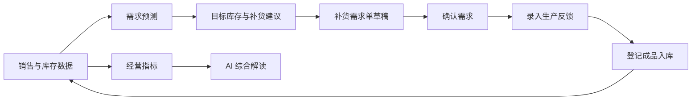

# StockPilot

### 电商需求预测与补货决策助手

StockPilot 面向单仓电商运营场景，把每日销售、库存和已确认入库数据转化为需求预测、目标库存与补货建议，并通过补货需求单承接生产确认和成品入库，形成可追踪的备货闭环。

**在线体验：** [https://stockpilot-n6qf.onrender.com](https://stockpilot-n6qf.onrender.com)

> 在线演示部署在 Render 免费实例上。长时间无人访问后，首次打开可能需要约 50 秒唤醒；首次计算全部商品也需要等待模型完成回测。

## 1. 项目背景

电商运营通常能看到销量和当前库存，却仍需要人工回答几件事：未来一段时间大约会卖多少、现有库存能否覆盖生产提前期、已确认入库是否来得及，以及应该向生产部门提出多少补货需求。

StockPilot 将这段工作拆成一条可执行流程：

1. 导入商品目录与每日销售库存台账，或加载内置示例数据。
2. 根据历史销量比较多种预测模型，为每个商品选择回测表现更好的方法。
3. 结合生产提前期、目标服务水平、现货和及时到达的已确认入库，计算目标库存与建议补货量。
4. 将建议转成补货需求单，记录生产确认、承诺日期和分批入库。
5. 库存变化回写工作区，更新缺货风险、销售库存指标和经营分析。

项目聚焦“销售端提出补货需求、生产端反馈、成品入库”的协作场景，不替代 ERP、产能排程或采购系统。

## 2. 核心功能

| 模块 | 功能 |
| --- | --- |
| 总览 | 汇总现货、待生产确认、已确认待入库和需要关注的商品；展示补货与入库事件 |
| 需求计划 | 自动预测商品需求，计算目标库存、安全库存、预计缺货时间、销售额风险和建议新增数量 |
| 补货需求单 | 支持草稿、需求确认、生产反馈、部分入库、全部入库和取消剩余需求 |
| 库存明细 | 查看当前库存和库存流水，核对“期末库存＝期初库存＋入库－销量”，支持 CSV 导出 |
| 销售明细 | 按日期和商品查询销量、售价及当日入库，支持搜索、时间筛选与 CSV 导出 |
| 经营分析 | 展示销售额、销量、日均库存、库存周转、品类结构、趋势及商品排行，并生成销售与库存解读 |
| 数据与设置 | 上传本地 CSV、加载示例数据，设置生产提前期和目标服务水平 |

### 需求预测与补货决策

StockPilot 对每个 SKU 独立比较四种候选方法：

- 季节性朴素预测
- 28 日移动平均
- LightGBM
- XGBoost

系统按时间顺序划分模型选择、误差校准和最终测试窗口，以保护期累计绝对误差选择模型。最终测试不参与模型选择；完成测试后，再使用全部历史生成未来预测。

目标库存由预测需求与历史误差共同确定，目标服务水平越高，安全库存通常越多。建议补货量按下面的业务口径计算：

```text
建议补货量 = max(0, 目标库存 - 当前现货 - 预测期内可到达的已确认入库)
```

预测、库存守恒、周转率和补货数量均由 Python 代码计算。大模型只读取已经计算好的结构化证据，生成销售表现和库存情况解读，不负责编造或修改业务数字。详细算法口径见 [ALGORITHM_REFERENCE.md](ALGORITHM_REFERENCE.md)。

### 补货闭环



生成草稿和确认需求不会重复训练预测模型。生产确认、入库或取消已确认需求后，系统复用已完成预测，更新在途数量、库存轨迹和剩余补货缺口；历史数据或预测参数改变时才重新计算。

## 3. 技术栈

| 模块 | 技术 |
| --- | --- |
| Web/API | FastAPI + Uvicorn |
| 前端 | HTML + CSS + JavaScript |
| Agent 编排 | LangGraph |
| 预测计算 | NumPy + scikit-learn + LightGBM + XGBoost |
| 模型接入 | OpenAI-compatible Chat Completions API |
| 持久化 | 本地 JSON；线上使用 PostgreSQL 按账号保存工作区 |
| 部署 | Render Blueprint |

## 4. 快速开始

### 环境要求

- Python 3.12 或更高版本
- Git

### 本地运行

```powershell
git clone https://github.com/wqr-code/stockpilot.git
cd stockpilot
python -m venv .venv
.venv\Scripts\python -m pip install -r requirements.txt
.venv\Scripts\python -m demo.web
```

macOS / Linux 将 `.venv\Scripts\python` 替换为 `.venv/bin/python`。启动完成后打开：

```text
http://127.0.0.1:3211
```

进入“数据与设置”，加载示例数据或上传自己的 CSV，填写生产提前期和目标服务水平，即可开始计算。

### 数据格式

页面导入窗口提供两份可直接下载的模板：

- 商品目录：SKU、商品名称、当前库存、售价等基础信息。
- 每日销售台账：日期、SKU、销量、售价、期初库存和当日入库数量。

系统按日核对库存守恒关系。没有入库时，`received_units` 填写 `0`；连续日期的期初库存可由前一日期末库存衔接。示例数据独立保存在 [`demo/data/`](demo/data/)，不需要连接 Shopify 或真实企业数据库。

## 5. AI 解读配置

需求预测、目标库存、补货建议和经营图表不依赖大模型。只有“经营分析”中的 AI 综合解读需要配置兼容 OpenAI Chat Completions 的模型 API。

复制 `.env.demo.example` 为 `.env.demo`，填写：

```env
DEMO_API_KEY=your_api_key
DEMO_BASE_URL=https://your-openai-compatible-endpoint/v1
DEMO_MODEL=your_model_name
```

不要将真实密钥写入代码、README 或 Git 提交记录。

- 使用公开演示网站时，访客调用部署者在服务器中配置的模型额度。
- 自行部署或本地运行时，使用者配置并承担自己的 API 额度与费用。
- 相同数据版本和统计范围会复用分析缓存，减少重复调用。

## 6. 部署

仓库提供 [`render.yaml`](render.yaml)，可通过 Render Blueprint 创建 FastAPI 服务和 PostgreSQL 数据库：

1. Fork 本仓库，或将代码推送到自己的 GitHub 仓库。
2. 在 Render 创建 Blueprint，并选择该仓库。
3. 等待数据库和 Web Service 构建完成。
4. 如需 AI 解读，在 Web Service 的 Environment 中配置 `DEMO_API_KEY`、`DEMO_BASE_URL` 和 `DEMO_MODEL`。
5. 使用 Render 提供的 `onrender.com` 地址访问应用。

线上模式启用注册登录，不同账号的数据、预测结果和业务单据分别保存。模型密钥只应存放在服务端环境变量中，不会下发到浏览器。

## 7. 项目结构

```text
demo/
├── web.py                  # FastAPI 入口、登录与数据导入
├── planning_workspace.py   # 预测任务、补货需求单与入库流程
├── demand_models.py        # 四种预测方法、回测与安全库存
├── analytics_agent.py      # LangGraph 经营分析 Agent
├── model_client.py         # OpenAI-compatible 模型接口
├── upload.html/js/css      # 操作界面
└── data/                   # 示例商品、销售与库存数据

tests/                      # 预测、单据、持久化和分析测试
render.yaml                 # Render 部署配置
ARCHITECTURE.md             # 系统边界与状态说明
ALGORITHM_REFERENCE.md      # 算法来源与计算口径
```

## 8. 测试

```powershell
.venv\Scripts\python -m pip install -r requirements-dev.txt
.venv\Scripts\python -m pytest
```

## 9. 参考项目与数据来源

本项目在设计和实现过程中参考了以下公开项目与资料，感谢相关作者：

- [5EBIN/Your.Store](https://github.com/5EBIN/Your.Store)：运营 Agent 的结构化工具调用、确定性计算与人工确认思路。
- [hsilvosa/retail-demand-forecasting](https://github.com/hsilvosa/retail-demand-forecasting)：多模型需求预测比较、误差校准与目标库存方法。
- [mfidalgomartins/supply-chain-service-inventory-intelligence](https://github.com/mfidalgomartins/supply-chain-service-inventory-intelligence)：连续库存台账与供应链分析示例。
- [programbeasts/AI_MockInterview](https://github.com/programbeasts/AI_MockInterview)：中文项目 README 的背景、功能、技术栈与部署说明结构。
- [UCI Online Retail](https://archive.ics.uci.edu/dataset/352/online+retail)：示例商品目录参考。销售、库存和入库流水由 StockPilot 模拟生成，不代表真实企业经营结果。

具体来源与保留文件见 [ATTRIBUTION.md](ATTRIBUTION.md)、[ALGORITHM_REFERENCE.md](ALGORITHM_REFERENCE.md) 和 [RETAIL_FORECASTING_LICENSE.txt](RETAIL_FORECASTING_LICENSE.txt)。

## 10. 使用与许可

StockPilot 是用于学习、研究和个人作品展示的非商业项目，作者不提供商业部署、商业售卖或商业集成授权。

仓库包含受 AGPL-3.0、MIT 和 CC BY 4.0 等上游条款约束的内容，各部分仍须遵循其原始许可证。由于 AGPL-3.0 本身允许在履行许可证义务的前提下进行商业使用，README 不能撤销上游作者已经授予的权利；[`LICENSE`](LICENSE) 继续适用于 AGPL 覆盖的代码。

StockPilot 名称、图标、README 文案及作者独立创作的演示素材仅授权用于学习、研究和个人作品展示。未经作者明确书面许可，不得将这些内容用于商业宣传、付费服务或冒充官方产品。任何商业使用还必须自行核对并遵守全部上游许可证和数据来源条款。

本项目按现状提供，不对预测精度、服务水平或实际经营结果作保证。
